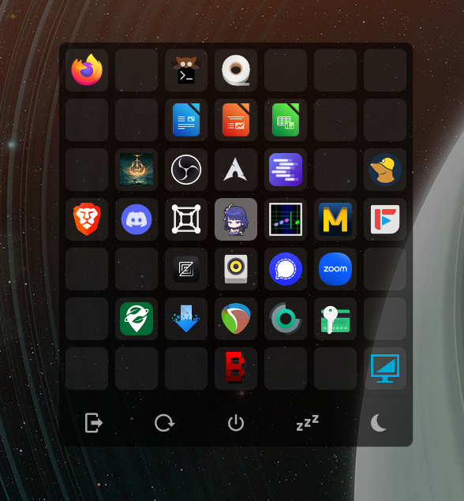

# wlgrid

A fast grid-based launcher for Wayland, inspired by Windows 10's Start menu. Built in Rust.



## Features

**Mouse**
- Click and drag to rearrange tiles
- Right-click to remove a tile
- Click empty tile to open app picker

**Keyboard**
- Arrow keys to navigate tiles
- Enter to launch focused app
- Type to search:
  - Matches zoxide directories first
  - Falls back to search engines
  - Paths with `/` or `~` get tab completion and open directly

**Bottom bar**
- Customizable quick-action buttons (logout, reboot, etc.)

## Config

`~/.config/wlgrid/config.toml`

```toml
width = 7
height = 6
opacity = 1.0

search_engines = """
Brave = https://search.brave.com/search?q={}
Claude = https://claude.ai/new?q={}
DuckDuckGo = https://duckduckgo.com/?q={}
"""

[bottom_bar]
font = 30
options = """
󰍃 = hyprshutdown
󰑓 = systemctl reboot
󰐥 = systemctl poweroff
󰒲 = systemctl hibernate
󰤄 = systemctl suspend
"""
```

## Dependencies

- Wayland compositor
- zoxide (optional, for directory matching)
