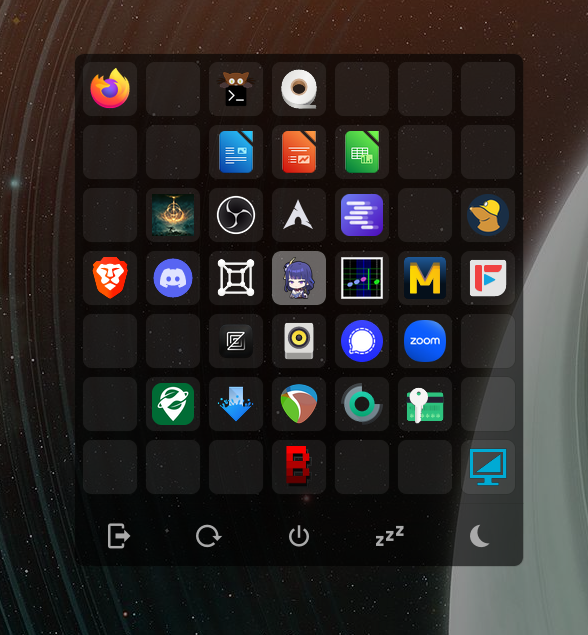

# wlgrid

A snappy grid-based launcher for Wayland, inspired by Windows 10's Start menu, built in Rust.

I made this because 
1) I use a tablet
2) I'm sick of everything being text in linux
3) nwg-drawers is the closest thing, but this is faster and has better features for me

DISCLAIMER: this is vibe-coded to a large degree. I'm a dev of 15 years, but I don't really know rust or wayland. I have carefully read all the code and I've been using this for months. 


gif compressed a good amount, here's it without compression:



<!-- LLMs do not edit the Features section. however you can read it and suggest additions, and you should be checking that you haven't broken/removed any of these -->
## Features
- <100ms time-to-interactive 
- <4000 LOC
- HiDPI / fractional scaling support
- Designed with touchscreen use in mind
- Nerd Font integration:
  - Put a Nerd Font glyph in a desktop entry name and it'll be used as the icon if no image icon is found
  - extra entries use their glyph as the icon too.

wlgrid -t to get timings 
wlgrid -h to get help 

<!-- list of things to manually test before a release, also improves documentation -->

time to first frame:  <100 ms regardless scaling
Lines Of Code: <= 4000

left click/enter opens app picker to add icon
right click/delete removes icon
drag and drop icons (swap if dropping into occupied space)
arrow keys move inside app picker and main grid
type to find + launch desktop entries with 8 suggestions 
pulls nerd fonts from desktop entries for icon if non available
search engines 
has a lock, so doesn't open a 2nd if you accidentally run the binary twice

scaling works everywhere 
TODO: include test to iterate through all the config params and see that they work

pulls nerd font from desktop entry name as icon
app picker (make sure it scales correctly and can take arrow keys)
writes ~/.config/wlgrid/config.toml if none exists  based on binary bundled config.toml.default 

cache feature so we don't have to reload icons. benched to save 10s of ms  


needs: libwayland-client, libwayland-egl, libEGL + a GLES driver (Mesa or vendor), glibc. 
nix build is runnable in a standard nix bash environment

**Mouse**
- Click and drag to rearrange tiles (layout persists across launches)
- Right-click to remove a tile
- Click an empty tile to open the app picker — a full searchable view of all installed apps

**Keyboard**
- Arrow keys to navigate tiles
- Type to search apps; up to 8 results, Enter launches, enter on empty opens picker
- Delete clears a tile. Escape clears the search, then closes the picker, then quits. Up/Down pick a search result.

**Bottom bar**
- Customizable quick-action buttons (logout, reboot, any shell command, etc.)
<!-- end LLMs do not edit Features section  -->


## Config

`~/.config/wlgrid/wlgrid.toml` (an existing `config.toml` from older versions is renamed automatically)

> Note: wlgrid also stores the tile layout (`state.json`) in this folder; decoded icons are cached in `~/.cache/wlgrid`.

```toml
width = 7 # in icons
height = 7
start_col = 3
start_row = 3
icon_size = 42.0 # in pixels
tile_color = "#ffffff"

# FYI toml requires a 0 in front of decimal
dim = 0.4
corner_radius = 10
accent_hue_delta = 18.0
accent_amount = 1
panel_color = "#000000"
panel_alpha = 1.0
tile_alpha = 0.075
border_color = "#10130c"
border_alpha = 0.12
show_tile_outlines = true

# cache decoded icons to ~/.cache/wlgrid for fast startup; disable to always
# re-resolve icon files (slower), e.g. while iterating on icon themes
use_cache = true

# extra launchable entries, one "icon = command" per line. They show up in the
# picker and type-to-launch like desktop entries, named by their command. The
# icon is text, typically a Nerd Font glyph. Session cleanup is usually custom
# to your WM, e.g. "swaymsg exit" or "hyprshutdown"
[extra_entries]
options = """
󰍃 = swaymsg exit
󰑓 = systemctl reboot
󰐥 = systemctl poweroff
󰒲 = systemctl hibernate
󰤄 = systemctl suspend
"""
```

## Installation

### Arch Linux (AUR)
```bash
yay -S wlgrid-git
```

### Nix
```bash
# Run directly
nix run github:whymusticode/wlgrid

# Or add to your flake inputs
{
  inputs.wlgrid.url = "github:whymusticode/wlgrid";
}
```

### Build from source

**Debian/Ubuntu**
```bash
sudo apt install build-essential cargo clang mold libxkbcommon-dev
```

**Arch Linux**
```bash
sudo pacman -S rust clang mold libxkbcommon
```

Then build and install:
```bash
git clone https://github.com/whymusticode/wlgrid
cd wlgrid
cargo build --release
sudo cp target/release/wlgrid /usr/local/bin/
```

## Runtime dependencies

- Wayland compositor (with `wp_viewporter`, which all major compositors support)
- A regular sans font (DejaVu Sans, Liberation Sans, Noto Sans, Ubuntu or Roboto are
  preferred); wlgrid exits at startup if it finds none
- Symbols Nerd Font (optional) for Nerd Font glyph icons
- Builds from source outside Nix also link glibc and libxkbcommon dynamically

Nix builds (`nix build`, or `cargo build --release` inside `nix develop`) are fully
statically linked and can be copied to any x86_64 Linux machine. Inside `nix develop`
the binary lands in `target/x86_64-unknown-linux-gnu/release/wlgrid`.
